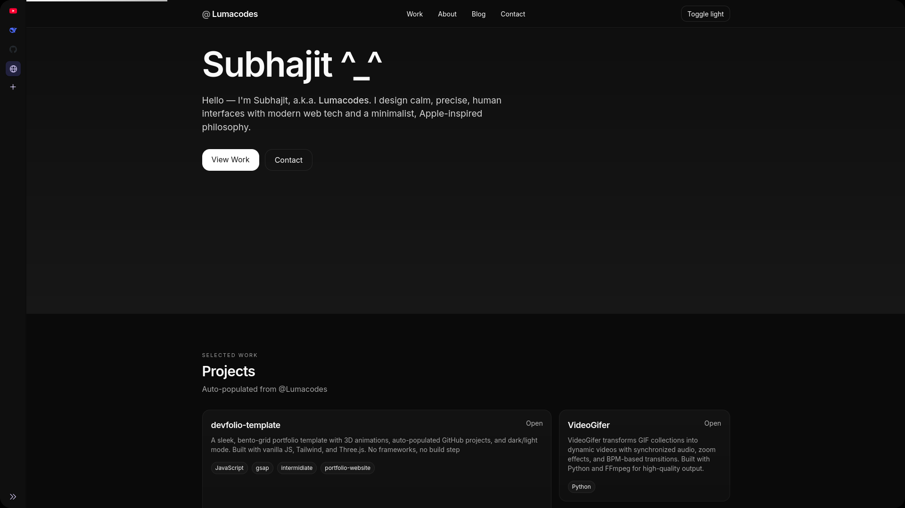
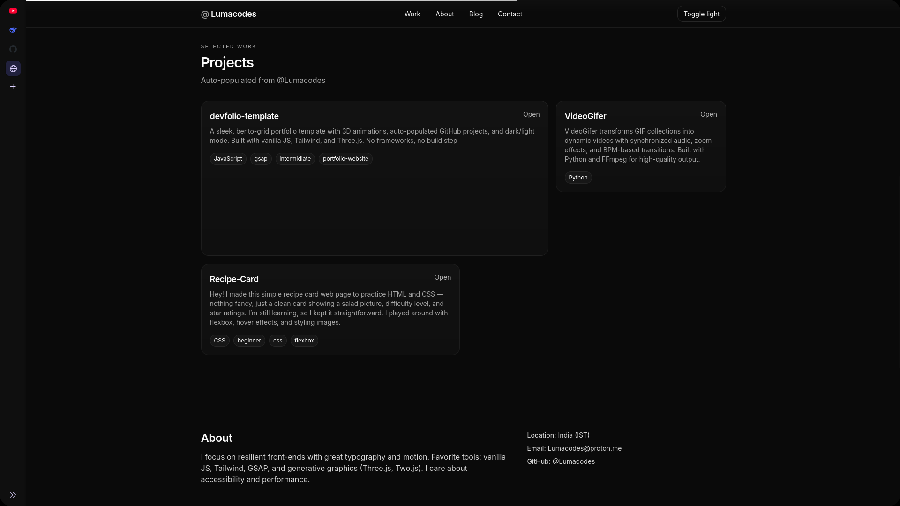

# DevFolio Template 🪄

<div class="bento-readme-grid">
  
  
  
</div>


> **A minimalist bento-grid portfolio** with 3D elements • GitHub integration • Dark/light mode  
> Live Demo: [luma.is-a.dev](https://luma.is-a.dev) • *No build step required*


## 🛠️ Tech Stack

| Component       | Technology              |
|-----------------|-------------------------|
| Styling         | Tailwind CSS            |
| Animations      | GSAP + ScrollTrigger    |
| 3D Graphics     | Three.js                |
| Font            | Inter (Google Fonts)    |
| Deployment      | GitHub Pages/Vercel/Netlify |


# i have rent to pay you can...
<div align="center">
  <a href="https://ko-fi.com/lumacodes" target="_blank">
    
  </a>
</div>

## ⚡ Quick Start

```bash
git clone https://github.com/Lumacodes/devfolio-template.git
cd devfolio-template
```


Edit index.html (name, bio, links)

Set GitHub username in js/main.js:

```bash
const GH_USER = 'yourusername'; // Replace with your GitHub username
```

# 🛠️ Customization
Color Scheme

Modify in index.html:

```bash
<script>
  tailwind.config = {
    theme: {
      extend: {
        colors: { // Add your palette:
          primary: '#3b82f6',
          secondary: '#10b981'
        }
      }
    }
  };
</script>
```
# 3D Settings

Adjust in js/threejs.js:
```bash
// Change material properties:
const material = new THREE.MeshPhysicalMaterial({
  color: 0x3b82f6, // New color
  metalness: 0.7,  // Adjust shine
  roughness: 0.1   // Surface texture
});
```

<div align="center">
  <a href="https://ko-fi.com/lumacodes" target="_blank">
    
  </a>
</div>

# 📜 GNU Licensed</strong> • 🎨 Free to use • 🤝 Contributions welcome!

<div align="center">
  <a href="https://ko-fi.com/lumacodes" target="_blank">
    
  </a>
</div>
